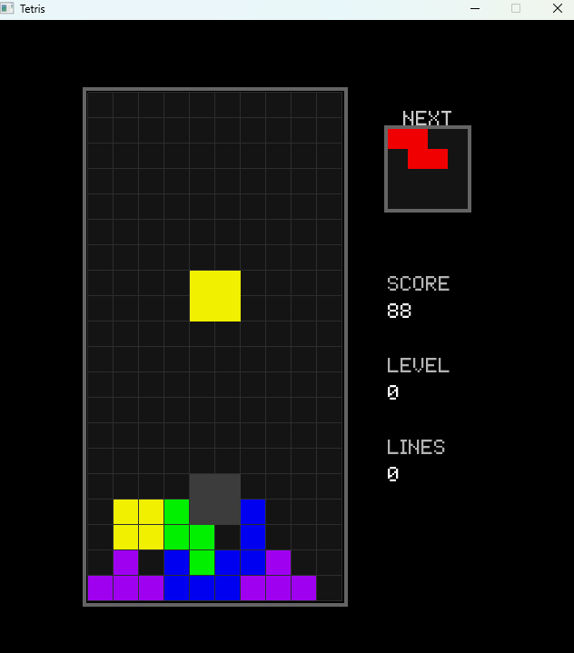

# Tetris

<p align="center">
  
</p>

<p align="center"><em>El Tetris original de NES, rehecho en C al milimetro.</em></p>

---

## Como jugar

| Tecla        | Accion               |
|--------------|----------------------|
| Left / Right | Mover pieza          |
| Down         | Caida suave (soft drop) |
| Up           | Rotar pieza (90 grados) |
| Space        | Caida instantanea (hard drop) |
| P            | Pausa                |
| Enter        | Iniciar / Reiniciar  |
| Escape       | Salir (titulo) / Pausa (juego) |

Limpia lineas completas para sumar puntos. Cada 10 lineas subes de nivel y la velocidad aumenta. La partida termina cuando una pieza nueva no puede aparecer (Block Out). Si tu puntuacion entra en el top 5, te pedira tus iniciales de 3 letras. Como en los salones de antes.

---

## Que trae

- Los 7 tetriminos clasicos (I, J, L, O, S, T, Z) con rotacion de 90 grados
- 30 niveles de velocidad (del 0 al 29), tabla identica a la NES original
- Sistema de puntuacion NES: Single = 40, Double = 100, Triple = 300, Tetris = 1200 (todo x nivel+1)
- Generador de piezas con reroll: si la pieza sale igual que la anterior, vuelve a tirar una vez
- Sin wall kicks (fiel al original: si la rotacion choca, simplemente falla)
- Lock delay breve que se reinicia al mover o rotar la pieza
- Caida suave (soft drop, +1 punto/fila) y caida instantanea (hard drop, +2 puntos/fila)
- DAS (Delayed Auto Shift) para movimiento lateral fluido
- Ghost piece que muestra donde caera la pieza
- Previsualizacion de la siguiente pieza
- Musica de fondo durante la partida (se para en pausa y game over)
- Tabla de los 5 mejores records guardada en disco
- Pantalla de titulo alternando entre el titulo y la tabla de records
- Entrada de 3 iniciales al conseguir un nuevo record

Todo ajustable desde `include/config.h`.

---

## Como lo arranco

### Windows

```cmd
scripts\install-deps.bat
scripts\build.bat run
```

### macOS / Linux

```bash
scripts/install-deps.sh
scripts/build.sh run
```

### Crear una version portable

```cmd
scripts\dist.bat       :: Windows
```
```bash
scripts/dist.sh        # macOS / Linux
```

En Windows genera la carpeta `dist/` con el `.exe`, su DLL y los recursos: la comprimes y corre en cualquier Windows 10/11 sin instalar nada. En macOS/Linux Allegro es libreria del sistema, asi que `dist/` lleva solo el binario y los recursos (la maquina destino necesita Allegro 5 instalado).

---

## Que necesita

- GCC (o MinGW en Windows)
- Allegro 5.2+
- pkg-config (macOS/Linux)

Los scripts de instalacion se encargan de todo solos.

---

Hecho por [Edu Diaz (RGiskard7)](https://github.com/RGiskard7) — MIT License
